# CarMate API 业务逻辑文档

> 基于 `E:\carMate_vision\backend` 实际代码整理
> 生成日期: 2026-07-13

---

## 目录

1. [架构总览](#1-架构总览)
2. [启动与路由注册](#2-启动与路由注册)
3. [认证模块 (auth)](#3-认证模块-auth)
4. [车牌识别模块 (plate)](#4-车牌识别模块-plate)
5. [交警手势模块 (police_gesture)](#5-交警手势模块-police_gesture)
6. [车主手势模块 (driver_gesture)](#6-车主手势模块-driver_gesture)
7. [告警管理模块 (alerts)](#7-告警管理模块-alerts)
8. [告警统计模块 (alert_stats)](#8-告警统计模块-alert_stats)
9. [仪表盘统计模块 (stats)](#9-仪表盘统计模块-stats)
10. [微信登录模块 (wechat)](#10-微信登录模块-wechat)
11. [管理后台模块 (admin)](#11-管理后台模块-admin)
12. [历史记录模块 (history)](#12-历史记录模块-history)
13. [通用设计模式](#13-通用设计模式)

---

## 1. 架构总览

```
┌────────────────────────────────────────────────────────────┐
│                      FastAPI 应用                           │
│                     (main.py: lifespan)                     │
├────────────────────────────────────────────────────────────┤
│  CORS 中间件 │ 数据库 Session │ 认证依赖注入                 │
├────────────────────────────────────────────────────────────┤
│  /api 前缀                                                  │
│  ┌──────────┬──────────┬──────────┬──────────┐             │
│  │  auth    │  plate   │ gesture  │ alerts   │             │
│  │  认证注册 │  车牌识别 │  手势识别 │  告警中心 │             │
│  │  19端点   │  8端点    │  9端点    │  9端点    │             │
│  ├──────────┼──────────┼──────────┼──────────┤             │
│  │  stats   │ history  │  admin   │ wechat   │             │
│  │  仪表盘   │  历史记录 │  管理后台 │  微信Mock │             │
│  │  1端点    │  2端点    │  4端点    │  13端点   │             │
│  └──────────┴──────────┴──────────┴──────────┘             │
├────────────────────────────────────────────────────────────┤
│  WebSocket                                                  │
│  ┌─────────────────────┬──────────────────────────────┐    │
│  │ /ws (告警推送)       │ /api/ws/plate/track/{id}     │    │
│  │ 订阅 alerts 频道     │ 实时车牌追踪结果推送           │    │
│  └─────────────────────┴──────────────────────────────┘    │
├────────────────────────────────────────────────────────────┤
│  基础服务层                                                  │
│  ┌──────────┬──────────┬──────────┬──────────────┐        │
│  │ 安全/加密 │ 数据库ORM │ 告警Agent │ 会话管理器     │        │
│  │ JWT+AES  │ SQLAlchemy│ 单例      │ 内存+文件     │        │
│  └──────────┴──────────┴──────────┴──────────────┘        │
└────────────────────────────────────────────────────────────┘
```

### 端点统计

| 模块 | 公开端点 | 需要登录 | 仅管理员 | 总计 |
|------|---------|---------|---------|------|
| auth | 7 | 12 | 0 | 19 |
| plate | 8 | 0 | 0 | 8 |
| police_gesture | 7 | 0 | 0 | 7 |
| driver_gesture | 2 | 0 | 0 | 2 |
| alerts + alert_stats | 0 | 5 | 4 | 9 |
| stats | 0 | 0 | 1 | 1 |
| wechat | 13 | 4 | 0 | 13 |
| admin | 0 | 0 | 4 | 4 |
| history | 0 | 2 | 0 | 2 |
| main.py (根+WS) | 4 | 0 | 0 | 4 |
| **合计** | **41** | **23** | **9** | **67** |

---

## 2. 启动与路由注册

### 2.1 应用启动流程

```
启动流程 (main.py: lifespan)
═══════════════════════════════════════

┌─────────────────────────────────────┐
│ 1. init_db()                        │
│    创建所有数据库表                   │
├─────────────────────────────────────┤
│ 2. seed_default_users(db)           │
│    admin/123456 + user/123456       │
│    如果已存在则跳过                   │
├─────────────────────────────────────┤
│ 3. migrate_user_privacy_fields(db)  │
│    加密已有用户的明文电话/邮箱         │
├─────────────────────────────────────┤
│ 4. 初始化 AlertAgent                │
│    set_cooldown(config)             │
│    event_collector.set_agent()      │
├─────────────────────────────────────┤
│ 5. 启动后台清理任务                   │
│    每5分钟: 清理过期session          │
├─────────────────────────────────────┤
│ 6. 注册路由 (所有 /api 前缀)          │
└─────────────────────────────────────┘
```

### 2.2 路由注册表 (`main.py`)

```python
# ── 伪代码 ──
app = FastAPI(lifespan=lifespan)
app.add_middleware(CORSMiddleware, allow_origins=["*"], allow_credentials=True)

# REST 路由 (全部挂载在 /api 下)
app.include_router(auth.router,        prefix="/api", tags=["用户认证"])
app.include_router(wechat.router,      prefix="/api", tags=["微信登录(Mock)"])
app.include_router(plate.router,       prefix="/api", tags=["车牌识别"])
app.include_router(police_gesture.router, prefix="/api", tags=["交警手势识别"])
app.include_router(driver_gesture.router, prefix="/api", tags=["车主手势控车"])
app.include_router(alerts.router,      prefix="/api", tags=["告警管理"])
app.include_router(alert_stats.router, prefix="/api", tags=["告警统计"])
app.include_router(stats.router,       prefix="/api", tags=["仪表盘统计"])
app.include_router(history.router,     prefix="/api", tags=["历史记录"])
app.include_router(admin_logs.router,  prefix="/api", tags=["管理员"])
app.include_router(admin_history.router, prefix="/api", tags=["管理员"])

# 硬编码端点
@app.get("/")        → {"message": "CarMate 后端...", "version": "2.0.0"}
@app.get("/api/health") → {"status": "healthy", "active_sessions": N}

# WebSocket
@app.websocket("/ws")                        → ws_alert_manager 告警推送
@app.websocket("/api/ws/plate/track/{id}")   → 实时车牌追踪
```

### 2.3 统一响应格式

```
成功: {"code": 0, "message": "success", "data": {...}}
失败: {"code": 400-500, "message": "错误描述", "data": null}
      认证相关失败额外带 "authErrorCode": "NOT_REGISTERED" 等
```

---

## 3. 认证模块 (auth)

**文件**: `backend/app/api/v1/auth.py`
**路由前缀**: `/auth` → 完整路径 `/api/auth/*`

### 3.1 认证流程图

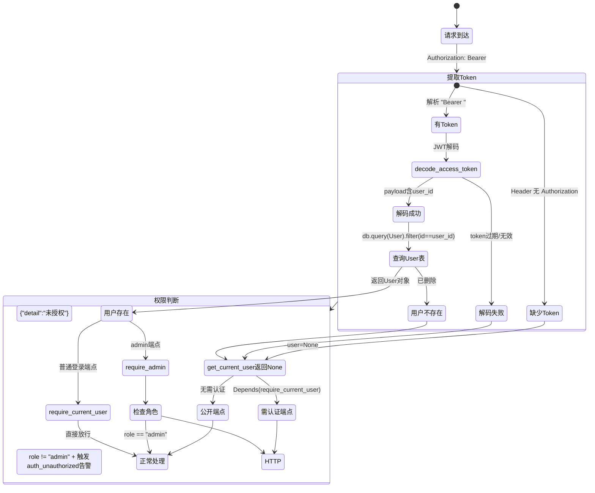

### 3.2 依赖注入链

```python
# 依赖注入层次（伪代码）

# 第1层: 从Header提取用户 (无异常抛出)
async def get_current_user(
    authorization: str = Header(None),  # "Bearer <token>"
    db: Session = Depends(get_db)
) -> User | None:
    if not authorization: return None
    payload = decode_access_token(token)     # JWT解码
    if not payload: return None
    user = db.query(User).filter(id == payload["user_id"]).first()
    return user  # None 表示未认证/令牌无效

# 第2层: 要求登录 (抛出401)
async def require_current_user(
    user = Depends(get_current_user)
) -> User:
    if user is None:
        raise HTTPException(401)
    return user

# 第3层: 要求管理员 (抛出403 + 安全告警)
async def require_admin(
    user = Depends(require_current_user)
) -> User:
    if user.role != "admin":
        event_collector.collect(AnomalyEvent(  # 安全事件告警
            source="auth",
            anomaly_type="auth_unauthorized",
            title=f"非管理员尝试访问管理接口",
            detail={"username": user.username}
        ))
        raise HTTPException(403)
    return user
```

### 3.3 注册流程

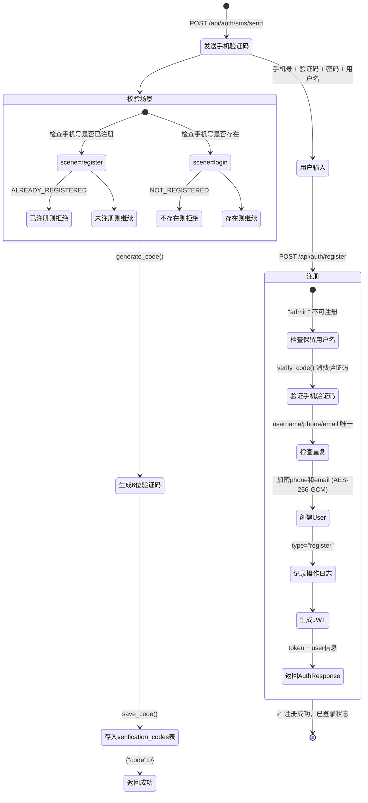

### 3.4 登录流程

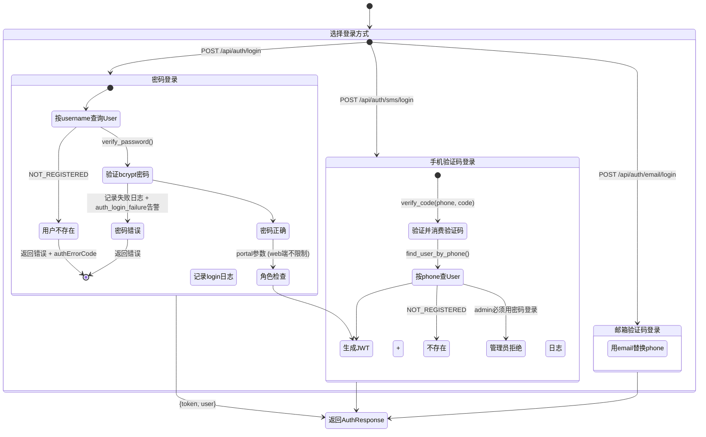

### 3.5 绑定/解绑/换绑流程 (伪代码)

```python
# ═══════════════════════════════════════
# 绑定手机: POST /api/auth/bind/phone
# ═══════════════════════════════════════
def bind_phone(user, phone, code):
    # 1. 检查已绑定
    if user.phone_enc:
        return fail("已绑定手机号")

    # 2. 消费验证码 (一次性)
    verify_code(db, target=phone, code=code)

    # 3. 检查该手机号是否被其他用户绑定
    existing = find_user_by_phone(db, phone)
    if existing and existing.id != user.id:
        return fail("该手机号已被绑定")

    # 4. 加密存储
    assign_phone(db, user, phone)
    db.commit()

    # 5. 操作日志
    log_operation(db, user, "bind_phone", target=phone)
    return ok(user_to_out(user))


# ═══════════════════════════════════════
# 解绑手机: POST /api/auth/unbind/phone
# ═══════════════════════════════════════
def unbind_phone(user, code):
    # 1. 安全检查: 至少保留一种登录方式
    ensure_can_remove_method(db, user, "phone")
    # 逻辑: 密码 OR 微信 OR (邮箱 AND 至少一个已绑定)

    # 2. 获取明文手机号
    phone = get_phone_plain(user)  # AES解密
    if not phone:
        return fail("未绑定手机号")

    # 3. 消费验证码
    verify_code(db, target=phone, code=code)

    # 4. 清除
    user.phone_enc = None
    db.commit()
    log_operation(db, user, "unbind_phone")
    return ok(user_to_out(user))


# ═══════════════════════════════════════
# 换绑手机: POST /api/auth/rebind/phone
# ═══════════════════════════════════════
def rebind_phone(user, old_code, new_phone, new_code):
    # 1. 获取当前手机
    phone = get_phone_plain(user)
    if not phone:
        return fail("未绑定手机号")

    # 2. 验证旧手机验证码
    verify_code(db, target=phone, code=old_code)

    # 3. 验证新手机验证码
    verify_code(db, target=new_phone, code=new_code)

    # 4. 检查新号码归属
    existing = find_user_by_phone(db, new_phone)
    if existing and existing.id != user.id:
        return fail("该号码已被绑定")

    # 5. 更新加密的手机号
    assign_phone(db, user, new_phone)
    db.commit()
    log_operation(db, user, "rebind_phone")
    return ok(user_to_out(user))
```

### 3.6 修改密码与注销账号流程

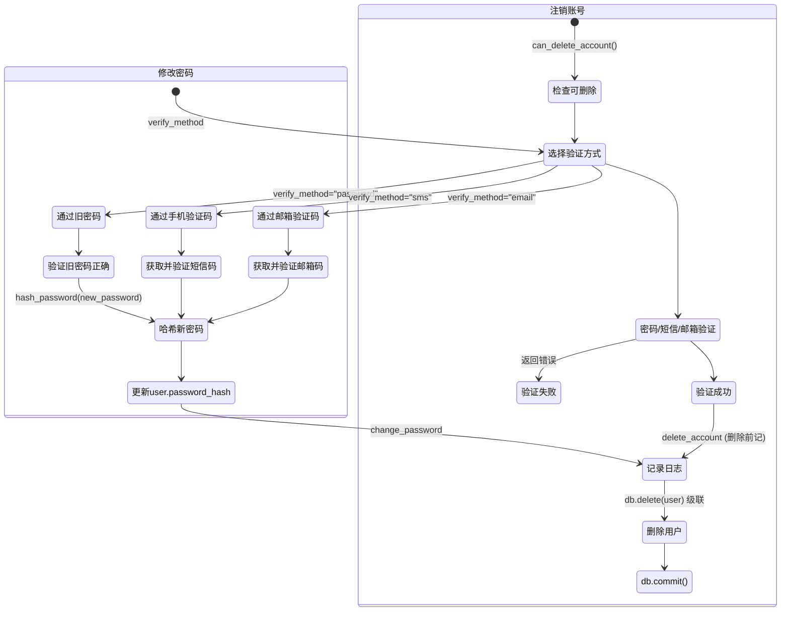

---

## 4. 车牌识别模块 (plate)

**文件**: `backend/app/api/v1/plate.py`
**完整路径**: `/api/plate/*`, `/api/plate/stream/*`
**认证**: 全部可选 (user 可能为 None)

### 4.1 单次识别流程图

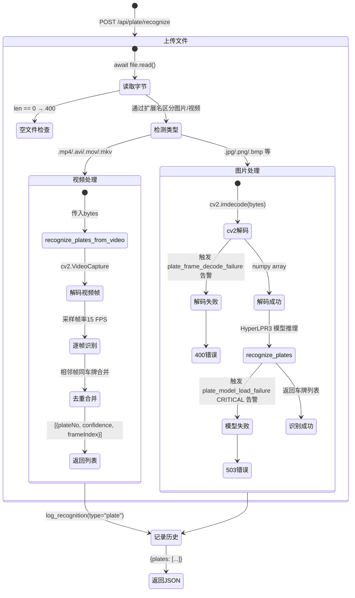

### 4.2 视频追踪流程 (会话模式)

```python
# ═══════════════════════════════════════
# 视频追踪: POST /api/plate/track
# ═══════════════════════════════════════
async def track_video(file: UploadFile, user, db):
    # 1. 读取视频到临时文件
    contents = await file.read()
    if not contents:
        raise HTTPException(400, "文件为空")

    with tempfile.NamedTemporaryFile(suffix=ext, delete=False) as tmp:
        tmp.write(contents)
        tmp_path = tmp.name

    # 2. 获取视频总帧数
    cap = cv2.VideoCapture(tmp_path)
    total_frames = int(cap.get(cv2.CAP_PROP_FRAME_COUNT))
    cap.release()

    # 3. 创建内存会话 (非数据库)
    session = session_manager.create_session(
        session_type=SessionType.VIDEO,
        source_path=tmp_path,
        total_frames=total_frames,
        delete_source_on_cleanup=True  # 任务完成后自动删临时文件
    )

    # 4. 记录识别历史
    log_recognition(db, user, type="plate", success=True,
                    summary=f"视频追踪: {file.filename}")

    # 5. 返回会话信息
    return {
        "sessionId": session.id,
        "fileName": file.filename,
        "fileSize": len(contents),
        "totalFrames": total_frames,
        "status": "processing",
        "wsEndpoint": f"/api/ws/plate/track/{session.id}"
    }
```

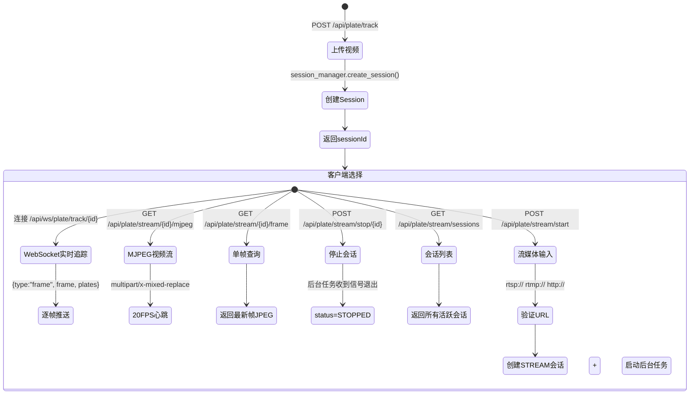

---

## 5. 交警手势模块 (police_gesture)

**文件**: `backend/app/api/v1/police_gesture.py`
**完整路径**: `/api/police-gesture/*`

### 5.1 识别流程图

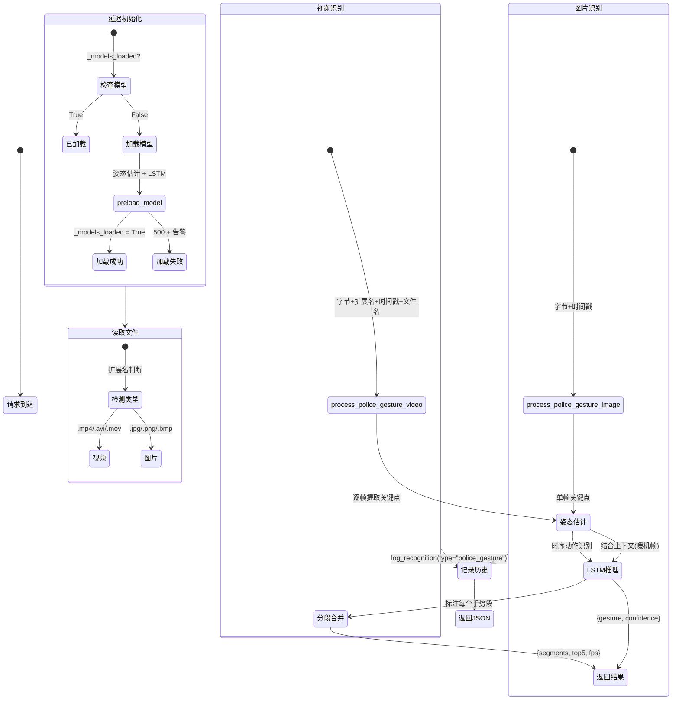

### 5.2 流式识别伪代码

```python
# ═══════════════════════════════════════
# 流式识别: POST /api/police-gesture/recognize/stream
# 返回: text/event-stream (SSE)
# ═══════════════════════════════════════
async def recognize_stream(file: UploadFile):
    ensure_models_loaded()
    validate_video_extension(file.filename)

    return StreamingResponse(
        generate_police_gesture_video_stream(contents, ext, timestamp, filename),
        media_type="text/event-stream"
    )
    # SSE格式:
    # data: {"type":"progress","frame":42,"totalFrames":300}
    # data: {"type":"result","segments":[...],"currentGesture":"停止"}
    # data: {"type":"done","segments":[...]}


# ═══════════════════════════════════════
# 逐帧流式: POST /api/police-gesture/stream/frame
# 前端逐帧发送图片, 后端维护LSTM状态
# ═══════════════════════════════════════
async def stream_frame(file: UploadFile, stream_id: str, user, db):
    ensure_models_loaded()
    contents = await file.read()
    if not contents:
        raise HTTPException(400)

    result = process_stream_frame(contents, stream_id)
    # result = {
    #     "gesture": "停止",
    #     "confidence": 0.95,
    #     "segmentChanged": True,  # 手势段变化标记
    #     "segmentStart": 1.5,     # 当前段起始秒数
    #     "landmarks": [...]       # 手部关键点
    # }

    if result.get("segmentChanged"):
        # 手势段切换时记录历史
        log_recognition(db, user, type="police_gesture",
                        success=True, summary=f"手势: {result['gesture']}")

    return result
```

---

## 6. 车主手势模块 (driver_gesture)

**文件**: `backend/app/api/v1/driver_gesture.py`
**特点**: 模块级全局状态 (LSTM追踪器在多个HTTP请求间保持状态)

### 6.1 识别与控制映射

```
┌──────────────────────────────────────────────────────────┐
│                  手势 → 控制动作映射                        │
├───────────────┬──────────────┬───────────────────────────┤
│ 手势          │ gesture_id   │ controlAction             │
├───────────────┼──────────────┼───────────────────────────┤
│ open_palm     │ 1            │ play_pause (播放)          │
│ fist          │ 0            │ play_pause (暂停)          │
│ thumb_up      │ 2            │ volume_up                 │
│ thumb_down    │ 3            │ volume_down               │
│ swipe_left    │ 4            │ prev_track (上一首)        │
│ swipe_right   │ 5            │ next_track (下一首)        │
│ rotate_cw     │ 6            │ temperature_up            │
│ rotate_ccw    │ 7            │ temperature_down          │
│ no_hand       │ -1           │ (无操作)                  │
│ unknown       │ -2           │ (无操作, 低置信度)         │
└───────────────┴──────────────┴───────────────────────────┘
```

### 6.2 手势段逻辑流程图

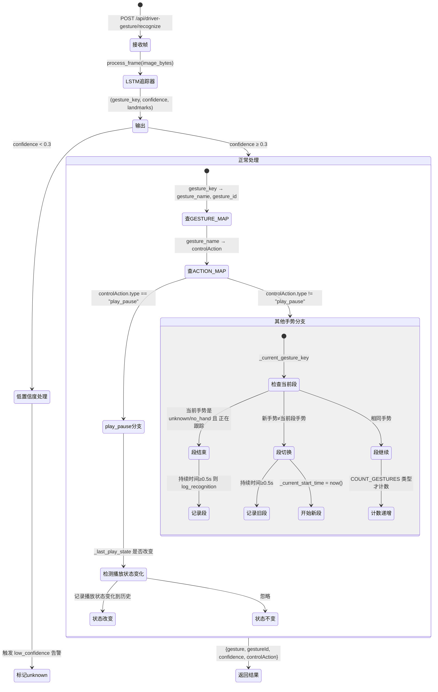

### 6.3 关键伪代码

```python
# 模块级全局状态 (跨请求)
_tracker: LSTMGestureTracker = None
_current_gesture_key: str = None   # 当前手势段
_current_start_time: float = 0     # 当前段起始时间
_current_count: int = 0            # 当前段内计数 (仅计COUNT类型)
_last_play_state: str = None       # 上一次播放状态 (play/pause)

COUNT_GESTURES = {"rotate_cw", "rotate_ccw", "thumb_up", "thumb_down"}

async def recognize_frame(file: UploadFile, user, db):
    contents = await file.read()
    if not contents:
        raise HTTPException(400, "文件为空")

    # 1. LSTM推理
    gesture_key, confidence, landmarks = _get_tracker().process_frame(contents)

    # 2. 查表
    gesture_id = GESTURE_MAP.get(gesture_key, -2)
    gesture_name = {v:k for k,v in GESTURE_MAP.items()}.get(gesture_key, "未知手势")
    control_action = ACTION_MAP.get(gesture_name)

    # 3. 低置信度降级
    if confidence < 0.3:
        gesture_id = -2  # unknown
        control_action = None
        event_collector.collect(AnomalyEvent(
            source="driver_gesture",
            anomaly_type="driver_gesture_low_confidence",
            title="车主手势置信度偏低",
            detail={"gesture": gesture_name, "confidence": confidence}
        ))

    # 4. 播放/暂停逻辑 (瞬时动作)
    if control_action and control_action.get("type") == "play_pause":
        new_state = control_action["action"]  # "play" 或 "pause"
        if new_state != _last_play_state:
            _last_play_state = new_state
            log_recognition(db, user, "driver_gesture", success=True,
                            summary=f"播放状态: {new_state}")
            _reset_segment()

    # 5. 操作段逻辑 (持续动作)
    elif gesture_id >= 0:  # 有效手势
        if gesture_key != _current_gesture_key:
            # 手势切换 → 记录旧段
            if _current_gesture_key:
                _flush_segment(db, user)
            # 开始新段
            _current_gesture_key = gesture_key
            _current_start_time = time.time()
            _current_count = 0

        if gesture_key in COUNT_GESTURES:
            _current_count += 1
    else:
        # unknown/no_hand → 结束当前段
        if _current_gesture_key:
            _flush_segment(db, user)

    return DriverGestureResult(
        gesture=gesture_name,
        gestureId=gesture_id,
        confidence=confidence,
        controlAction=control_action
    )
```

---

## 7. 告警管理模块 (alerts)

**文件**: `backend/app/api/v1/alerts.py`
**认证**: admin only
**完整路径**: `/api/alerts`

### 7.1 流程图

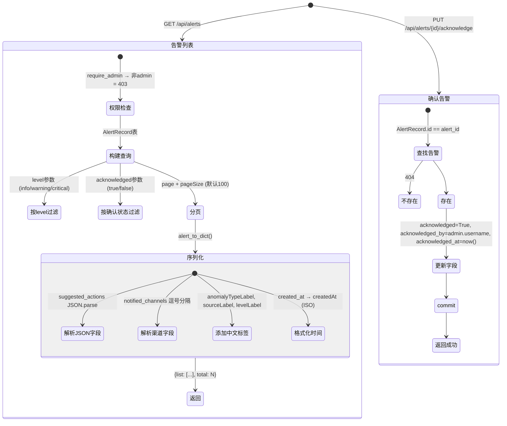

### 7.2 伪代码

```python
async def get_alerts(db, admin, page=1, pageSize=100, level=None, acknowledged=None):
    query = db.query(AlertRecord)

    if level:
        query = query.filter(AlertRecord.level == level)
    if acknowledged is not None:
        query = query.filter(AlertRecord.acknowledged == acknowledged)

    total = query.count()
    records = (query
               .order_by(AlertRecord.id.desc())
               .offset((page - 1) * pageSize)
               .limit(pageSize)
               .all())

    return ok({
        "list": [alert_to_dict(r) for r in records],
        "total": total
    })


async def acknowledge_alert(alert_id, admin, db):
    alert = db.query(AlertRecord).filter(AlertRecord.id == alert_id).first()
    if not alert:
        return fail("告警不存在", code=404)

    alert.acknowledged = True
    alert.acknowledged_by = admin.username
    alert.acknowledged_at = datetime.now(timezone.utc)
    db.commit()

    return ok(None, "已确认")
```

---

## 8. 告警统计模块 (alert_stats)

**文件**: `backend/app/api/v1/alert_stats.py`
**认证**: 需要登录 (任意角色)
**完整路径**: `/api/alerts/*`

### 8.1 端点总览

| 端点 | 认证 | 功能 |
|------|------|------|
| GET `/alerts/stats?days=7` | 登录 | 聚合统计: total/unacknowledged/todayCount/totalByLevel/byAnomalyType/dailyTrend/avgResponseMin |
| GET `/alerts/timeline?page&pageSize&startDate&endDate&level&anomalyType` | 登录 | 分页时间线，按日期分组 |
| GET `/alerts/{id}/detail` | 登录 | 告警详情+rawEvent回放+关联告警(±1h同类) |
| GET `/alerts/analysis?days=7` | 登录 | topTypes/sourceDist/peakHours/ackRate |
| GET `/alerts/anomaly-types` | 登录 | 14种异常类型列表 |
| POST `/alerts/test?type&level` | admin | 触发测试告警，用于调试 |
| PUT `/alerts/batch-acknowledge?ids=1,2,3` | admin | 批量确认 |

### 8.2 统计分析伪代码

```python
# ═══════════════════════════════════════
# GET /api/alerts/stats
# ═══════════════════════════════════════
async def get_alert_stats(db, user, days=7):
    # 委托给 AlertAgent 单例
    return ok(alert_agent.get_stats(db, days))

# AlertAgent.get_stats() 实现:
def get_stats(self, db, days):
    since = datetime.now() - timedelta(days=days)
    today_start = datetime.now().replace(hour=0, minute=0, second=0)

    # 总数
    total = db.query(AlertRecord).filter(AlertRecord.created_at >= since).count()
    unacknowledged = db.query(AlertRecord).filter(
        AlertRecord.created_at >= since,
        AlertRecord.acknowledged == False
    ).count()
    today_count = db.query(AlertRecord).filter(
        AlertRecord.created_at >= today_start
    ).count()

    # 按级别分布
    total_by_level = {}
    for level in ["info", "warning", "critical"]:
        cnt = db.query(AlertRecord).filter(
            AlertRecord.created_at >= since,
            AlertRecord.level == level
        ).count()
        total_by_level[level] = cnt

    # 按异常类型分布
    rows = db.query(
        AlertRecord.anomaly_type,
        func.count(AlertRecord.id)
    ).filter(
        AlertRecord.created_at >= since
    ).group_by(AlertRecord.anomaly_type).all()
    by_type = {row[0]: row[1] for row in rows}

    # 每日趋势 (含级别维度)
    daily_rows = db.query(
        func.date(AlertRecord.created_at),
        AlertRecord.level,
        func.count(AlertRecord.id)
    ).filter(
        AlertRecord.created_at >= since
    ).group_by(
        func.date(AlertRecord.created_at),
        AlertRecord.level
    ).all()
    # → 结构化为 [{date, info, warning, critical}]

    # 平均响应时间
    avg_min = db.query(
        func.avg(
            func.timestampdiff(text("MINUTE"),
                               AlertRecord.created_at,
                               AlertRecord.acknowledged_at)
        )
    ).filter(
        AlertRecord.created_at >= since,
        AlertRecord.acknowledged == True
    ).scalar() or 0

    return {
        "total": total,
        "unacknowledged": unacknowledged,
        "todayCount": today_count,
        "totalByLevel": total_by_level,
        "byAnomalyType": by_type,
        "dailyTrend": daily_trend,
        "avgResponseMinutes": round(avg_min, 1)
    }


# ═══════════════════════════════════════
# GET /api/alerts/analysis
# ═══════════════════════════════════════
async def get_alert_analysis(db, user, days=7):
    since = datetime.now() - timedelta(days=days)

    # Top异常类型 (按频次)
    top_types = db.query(
        AlertRecord.anomaly_type,
        func.count(AlertRecord.id).label("cnt")
    ).filter(AlertRecord.created_at >= since) \
     .group_by(AlertRecord.anomaly_type) \
     .order_by(func.count(AlertRecord.id).desc()) \
     .limit(10).all()

    # 来源模块分布
    source_dist = db.query(
        AlertRecord.source,
        func.count(AlertRecord.id)
    ).filter(AlertRecord.created_at >= since) \
     .group_by(AlertRecord.source).all()

    # 峰值时段 (按小时)
    peak_hours = db.query(
        func.hour(AlertRecord.created_at),
        func.count(AlertRecord.id)
    ).filter(AlertRecord.created_at >= since) \
     .group_by(func.hour(AlertRecord.created_at)).all()

    # 确认率
    total = db.query(AlertRecord).filter(AlertRecord.created_at >= since).count()
    acked = db.query(AlertRecord).filter(
        AlertRecord.created_at >= since,
        AlertRecord.acknowledged == True
    ).count()
    ack_rate = round(acked / total * 100, 1) if total > 0 else 0

    return ok({
        "topAnomalyTypes": [{"type": t, "count": c} for t, c in top_types],
        "sourceDistribution": [{"source": s, "count": c} for s, c in source_dist],
        "peakHours": [{"hour": h, "count": c} for h, c in peak_hours],
        "ackRate": ack_rate,
        "total": total,
        "acknowledged": acked
    })
```

---

## 9. 仪表盘统计模块 (stats)

**文件**: `backend/app/api/v1/stats.py`
**认证**: admin only

### 9.1 数据聚合流程图

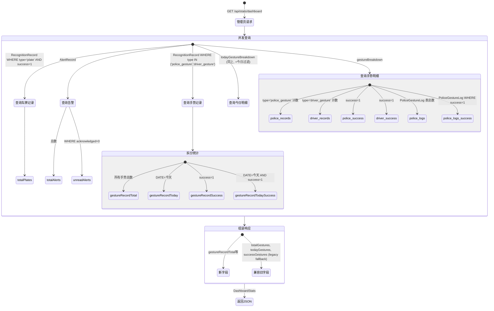

### 9.2 伪代码

```python
async def get_dashboard_stats(db, admin):
    # ── 车牌统计 ──
    total_plates = db.query(RecognitionRecord).filter(
        RecognitionRecord.type == "plate",
        RecognitionRecord.success == True
    ).count()

    # ── 手势统计 ──
    gesture_base = db.query(RecognitionRecord).filter(
        RecognitionRecord.type.in_(["police_gesture", "driver_gesture"])
    )
    gesture_total = gesture_base.count()
    gesture_today = gesture_base.filter(
        func.date(RecognitionRecord.created_at) == date.today()
    ).count()
    gesture_success = gesture_base.filter(RecognitionRecord.success == True).count()
    gesture_today_success = gesture_base.filter(
        RecognitionRecord.success == True,
        func.date(RecognitionRecord.created_at) == date.today()
    ).count()

    # ── 告警统计 ──
    total_alerts = db.query(AlertRecord).count()
    unread_alerts = db.query(AlertRecord).filter(
        AlertRecord.acknowledged == False
    ).count()

    # ── 手势明细 ──
    def build_breakdown(today_only=False):
        base = db.query(RecognitionRecord)
        if today_only:
            base = base.filter(func.date(RecognitionRecord.created_at) == date.today())

        police = base.filter(RecognitionRecord.type == "police_gesture")
        driver = base.filter(RecognitionRecord.type == "driver_gesture")

        logs_base = db.query(PoliceGestureLog)
        if today_only:
            logs_base = logs_base.filter(func.date(PoliceGestureLog.createdAt) == date.today())

        return {
            "policeRecords": police.count(),
            "driverRecords": driver.count(),
            "policeRecordsSuccess": police.filter(RecognitionRecord.success == True).count(),
            "driverRecordsSuccess": driver.filter(RecognitionRecord.success == True).count(),
            "policeInferenceLogs": logs_base.count(),
            "policeInferenceLogsSuccess": logs_base.filter(PoliceGestureLog.success == True).count(),
        }

    return ok({
        # 新字段
        "gestureRecordTotal": gesture_total,
        "gestureRecordToday": gesture_today,
        "gestureRecordSuccess": gesture_success,
        "gestureRecordTodaySuccess": gesture_today_success,
        "totalPlates": total_plates,
        "totalAlerts": total_alerts,
        "unreadAlerts": unread_alerts,
        "gestureBreakdown": build_breakdown(today_only=False),
        "todayGestureBreakdown": build_breakdown(today_only=True),
        # 兼容旧字段
        "totalGestures": gesture_total,
        "todayGestures": gesture_today,
        "successGestures": gesture_success,
    })
```

---

## 10. 微信登录模块 (wechat)

**文件**: `backend/app/api/v1/wechat.py`
**认证**: 大多数端点无需登录 (除 bind/unbind/rebind/delete 的 qrcode 生成)
**特点**: Mock 实现, 内存会话 (不持久化)

### 10.1 Mock 微信 OAuth 流程

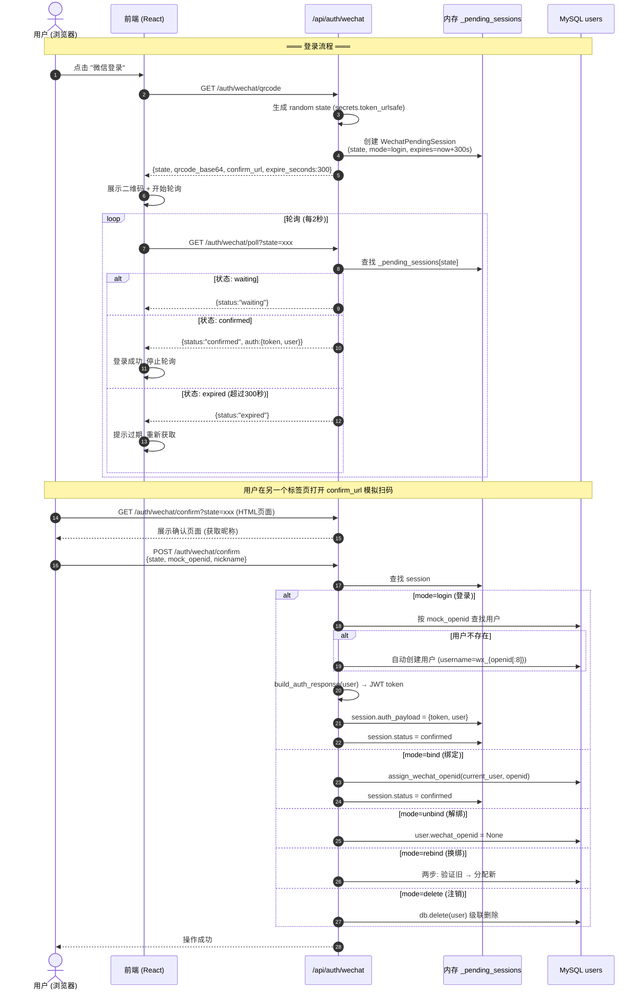

### 10.2 会话模式说明

| mode | 触发端点 | 认证 | 业务操作 |
|------|---------|------|---------|
| `login` | GET `/qrcode` | 无 | 登录或自动注册 |
| `bind` | GET `/bind/qrcode` | 必需 | 绑定微信到已有账号 |
| `unbind` | GET `/unbind/qrcode` | 必需 | 解绑微信 (前提: 至少保留一种登录方式) |
| `rebind` | GET `/rebind/qrcode` | 必需 | 先验证旧微信 → 绑定新微信 |
| `delete` | GET `/delete/qrcode` | 必需 | 验证微信所有权 → 注销账号 |

---

## 11. 管理后台模块 (admin)

### 11.1 操作日志 (`admin_logs.py`)

```python
# ═══════════════════════════════════════
# GET /api/admin/operation-logs
# ═══════════════════════════════════════
async def get_operation_logs(
    db, admin,
    page=1, pageSize=20,
    username=None,     # LIKE 模糊匹配
    action=None,       # 精确匹配 (register/login/bind_phone/...)
    success=None,      # 布尔
    startDate=None,    # YYYY-MM-DD
    endDate=None       # YYYY-MM-DD
):
    query = db.query(UserOperationLog)

    if username:
        query = query.filter(UserOperationLog.username.like(f"%{username}%"))
    if action:
        query = query.filter(UserOperationLog.action == action)
    if success is not None:
        query = query.filter(UserOperationLog.success == success)
    if startDate:
        query = query.filter(func.date(UserOperationLog.created_at) >= startDate)
    if endDate:
        query = query.filter(func.date(UserOperationLog.created_at) <= endDate)

    # 管理员查看日志本身也要记录
    log_operation(db, admin, "view_operation_logs",
                  detail=f"page={page}, filters=...")

    total = query.count()
    records = (query.order_by(UserOperationLog.id.desc())
               .offset((page-1)*pageSize).limit(pageSize).all())

    return ok({"list": [operation_log_to_dict(r) for r in records], "total": total})
```

### 11.2 识别记录管理 (`admin_history.py`)

```python
# ═══════════════════════════════════════
# GET /api/admin/recognition-records
# ═══════════════════════════════════════
async def get_admin_records(
    db, admin,
    page=1, pageSize=20,
    type=None,         # plate/police_gesture/driver_gesture
    sourceType=None,   # upload/stream/camera
    success=None,      # 布尔 (通过JSON字段过滤)
    keyword=None,      # 在 result_json 或 type 中 LIKE
    username=None,     # 按用户名过滤 (JOIN users)
    plateNo=None,      # 按车牌号过滤 (EXISTS 子查询 plate_records)
    startDate=None,
    endDate=None
):
    # JOIN: HistoryRecord ← User (left join)
    query = db.query(HistoryRecord, User.username).outerjoin(
        User, HistoryRecord.user_id == User.id
    )

    if type:
        query = query.filter(HistoryRecord.type == type)
    if sourceType:
        # source_type 存在 JSON 字段中
        query = query.filter(HistoryRecord.source_type.like(f'%"{sourceType}"%'))
    if success is not None:
        query = query.filter(HistoryRecord.result_json.like(f'%"success": {str(success).lower()}%'))
    if keyword:
        query = query.filter(or_(
            HistoryRecord.result_json.like(f"%{keyword}%"),
            HistoryRecord.type.like(f"%{keyword}%")
        ))
    if username:
        query = query.filter(User.username.like(f"%{username}%"))
    if plateNo:
        # EXISTS 子查询: 只返回包含该车牌的记录
        subq = db.query(PlateRecord.id).filter(
            PlateRecord.history_id == HistoryRecord.id,
            PlateRecord.plate_no == plateNo
        ).exists()
        query = query.filter(subq)

    if startDate:
        query = apply_created_at_start(query, HistoryRecord, startDate)
    if endDate:
        query = apply_created_at_end(query, HistoryRecord, endDate)

    total = query.count()
    results = (query.order_by(HistoryRecord.id.desc())
               .offset((page-1)*pageSize).limit(pageSize).all())

    return ok({
        "list": [history_record_to_dict(rec, username=uname) for rec, uname in results],
        "total": total
    })
```

---

## 12. 历史记录模块 (history)

**文件**: `backend/app/api/v1/history.py`
**认证**: 需要登录
**与 admin_history 的区别**: 只返回当前用户自己的记录

```python
# ═══════════════════════════════════════
# GET /api/history
# 过滤逻辑与 admin 完全相同, 但增加:
#   query = query.filter(HistoryRecord.user_id == current_user.id)
# ═══════════════════════════════════════
async def get_history(db, user, page=1, pageSize=20, ...):
    query = db.query(HistoryRecord).filter(
        HistoryRecord.user_id == user.id  # ← 唯一区别
    )
    # ... 其余过滤、分页逻辑与 admin 完全相同
```

---

## 13. 通用设计模式

### 13.1 统一响应格式

```
成功: {"code": 0, "message": "success", "data": {...}}
失败: {"code": 4xx/5xx, "message": "错误描述", "data": null}
```

### 13.2 认证层次

```
公开端点:     无 Depends → 任何人可访问 (register, login, 识别功能)
需登录:       Depends(require_current_user) → HTTP 401
仅管理员:     Depends(require_admin) → HTTP 401/403 + 安全告警
可选用户:     Depends(get_current_user) → user 可能为 None (用于非必须记录)
```

### 13.3 数据库操作模式

```python
# 所有数据库操作都遵循:
# 1. 通过 Depends(get_db) 获取 session
# 2. 在端点函数内执行查询/写入
# 3. 提交由端点负责 (db.commit())
# 4. 不在中间件层管理事务

def some_endpoint(
    db: Session = Depends(get_db),
    user: User = Depends(require_current_user)
):
    record = db.query(Model).filter(...).first()
    if not record:
        return fail("不存在", code=404)

    record.field = new_value
    db.commit()  # 端点直接提交
    return ok(result)
```

### 13.4 文件上传处理模式

```python
# 车牌识别 / 手势识别中的通用文件处理:

# 1. 临时文件模式 (视频处理)
contents = await file.read()
with tempfile.NamedTemporaryFile(suffix=ext, delete=False) as tmp:
    tmp.write(contents)
    tmp_path = tmp.name

# 2. 内存处理模式 (图片处理)
contents = await file.read()
image = cv2.imdecode(np.frombuffer(contents, np.uint8), cv2.IMREAD_COLOR)

# 3. 流式响应模式
return StreamingResponse(generator(), media_type="text/event-stream")
```

### 13.5 告警集成模式

```python
# 所有关键异常点都通过 EventCollector 上报:
from app.services.alert_agent import event_collector, AnomalyEvent, AlertLevel

event_collector.collect(AnomalyEvent(
    source="plate_recognition",         # 来源模块
    anomaly_type="plate_model_load_failure",  # 异常类型
    title="车牌识别模型加载失败",
    detail={"error": str(e)},
    severity_hint=AlertLevel.CRITICAL   # 严重程度
))
```

### 13.6 操作日志集成模式

```python
from app.services.operation_log_service import log_operation

log_operation(
    db=db,
    user=user,
    action="login",          # 操作类型
    success=True,            # 是否成功
    target="password",       # 操作对象
    detail="用户登录成功",
    request=request          # 可选, 用于记录IP
)
```

---

## 附录 A: 全 API 业务逻辑总流程图

> 以下一张图覆盖 CarMate 全部 67 个 API 端点的完整业务逻辑，按请求生命周期组织。

```mermaid
stateDiagram-v2
    direction TB

    %% ═══════════════════════════════════════════
    %% 阶段零: 应用启动
    %% ═══════════════════════════════════════════
    state "🚀 应用启动 (lifespan)" as startup {
        [*] --> init_db : 创建所有表
        init_db --> seed_users : admin/123456 + user/123456
        seed_users --> encrypt_privacy : AES加密已有明文字段
        encrypt_privacy --> init_alert_agent : set_cooldown + link to event_collector
        init_alert_agent --> start_cleanup : 后台定时清理过期session
        start_cleanup --> register_routes : 注册11个路由模块
        register_routes --> [*]
    }

    startup --> client_request : 应用就绪

    %% ═══════════════════════════════════════════
    %% 阶段一: 请求入口 & 认证
    %% ═══════════════════════════════════════════
    state "🌐 客户端请求" as client_request {
        [*] --> cors : CORS 中间件通过
        cors --> extract_token : 解析 Authorization: Bearer <token>
        extract_token --> token_present : token存在
        extract_token --> token_missing : token缺失

        token_present --> jwt_decode : JWT 解码
        jwt_decode --> jwt_fail : 过期/无效
        jwt_decode --> jwt_ok : payload {user_id}
        jwt_ok --> query_user : db.query(User).filter(id)
        query_user --> user_found : User对象
        query_user --> user_deleted : 已删除
        user_deleted --> token_missing

        token_missing --> route_guard : user=None
        jwt_fail --> route_guard : user=None
        user_found --> route_guard : user=User
    }

    state "🛡️ 路由守卫" as route_guard {
        [*] --> public : 公开端点 (无需认证)
        [*] --> optional : 可选用户 (get_current_user)
        [*] --> require_login : Depends(require_current_user)
        [*] --> require_admin : Depends(require_admin)

        public --> public_ok : 直接放行
        optional --> optional_ok : user可为None
        require_login --> login_401 : user is None → HTTP 401
        require_login --> login_ok : user存在
        require_admin --> admin_401 : user is None → HTTP 401
        require_admin --> admin_403 : role != admin → HTTP 403
        require_admin --> admin_ok : role == admin
        admin_403 --> alert : 触发 auth_unauthorized 安全告警
    }

    route_guard --> dispatch : 进入业务逻辑

    %% ═══════════════════════════════════════════
    %% 阶段二: 业务路由分发 (11个模块)
    %% ═══════════════════════════════════════════
    state "🔀 业务路由分发" as dispatch {

        state "📝 认证模块 /api/auth/*" as auth_branch {

            state "发送验证码" as send_code {
                [*] --> sms_or_email : sms / email
                sms_or_email --> scene_check : scene=register→检查手机未注册<br/>scene=login→检查手机已存在<br/>scene=bind→检查手机未绑定
                scene_check --> gen_code : generate_code() 6位随机
                gen_code --> save_code : 存入 verification_codes 表
                save_code --> send : sms→终端mock输出<br/>email→SMTP真实发送
                send --> return_ok : {code:0}
            }

            state "注册 POST /auth/register" as register {
                [*] --> check_reserved : 拒绝 "admin" 用户名
                check_reserved --> verify_phone : 消费手机验证码
                verify_phone --> check_dup : 查重 username/phone/email
                check_dup --> verify_email : 有email→消费邮箱验证码
                verify_email --> create_user : AES加密phone+email
                create_user --> jwt : 生成JWT token
                jwt --> log : 记录操作日志 register
                log --> return_auth : {token, user}
            }

            state "密码登录 POST /auth/login" as pwd_login {
                [*] --> find_user : 按username查询
                find_user --> not_found : 不存在 → NOT_REGISTERED
                find_user --> found : 存在
                found --> verify_pwd : bcrypt验证
                verify_pwd --> wrong_pwd : 失败 → 触发login_failure告警+日志
                verify_pwd --> ok_pwd : 成功
                ok_pwd --> role_gate : user门户→拒绝admin<br/>admin门户→要求admin
                role_gate --> jwt : 生成JWT
                jwt --> log : 记录 login 日志
                log --> return_auth : {token, user}
            }

            state "验证码登录" as code_login {
                [*] --> consume_code : verify_code() 消费验证码
                consume_code --> find_by : phone / email 查找用户
                find_by --> block_admin : admin→拒绝(必须密码)
                block_admin --> jwt : 生成JWT
                jwt --> return_auth : {token, user}
            }

            state "账户管理" as account_mgmt {
                state "绑定 bind" as bind {
                    [*] --> bind_check : 检查未绑定
                    bind_check --> bind_consume : 消费验证码
                    bind_consume --> bind_assign : AES加密分配
                    bind_assign --> bind_log : 操作日志
                }
                state "解绑 unbind" as unbind {
                    [*] --> ensure_keep : ensure_can_remove_method<br/>(至少保留1种登录方式)
                    ensure_keep --> unbind_consume : 消费验证码
                    unbind_consume --> unbind_null : phone_enc/email_enc=None
                }
                state "换绑 rebind" as rebind {
                    [*] --> old_verify : 消费旧验证码
                    old_verify --> new_verify : 消费新验证码
                    new_verify --> check_owner : 新号码/邮箱未被占用
                    check_owner --> assign_new : AES加密分配新值
                }
                state "修改密码" as change_pwd {
                    [*] --> verify_id : 旧密码/短信码/邮箱码 三选一验证
                    verify_id --> hash_new : bcrypt 哈希新密码
                }
                state "注销账号" as delete_acc {
                    [*] --> can_delete : can_delete_account()
                    can_delete --> verify_del : 密码/短信/邮箱 三选一验证
                    verify_del --> log_del : 删除前记录日志
                    log_del --> do_delete : db.delete(user) 级联
                    do_delete --> commit_del : db.commit()
                }
            }
        }

        state "💬 微信Mock /api/auth/wechat/*" as wechat_branch {
            [*] --> gen_qr : GET /qrcode → 生成state+base64二维码
            gen_qr --> create_session : 内存 _pending_sessions[state]
            create_session --> poll_loop : 前端轮询 GET /poll

            state poll_loop {
                [*] --> check_state : 查找session
                check_state --> waiting : status=waiting → 继续轮询
                check_state --> confirmed : status=confirmed → 返回token+user
                check_state --> expired : >300秒 → 提示过期
            }

            poll_loop --> confirm_html : 用户打开 confirm_url
            confirm_html --> post_confirm : POST /confirm

            state post_confirm {
                [*] --> mode_login : 登录→查找/自动创建用户→JWT
                [*] --> mode_bind : 绑定→assign_wechat_openid
                [*] --> mode_unbind : 解绑→openid=None
                [*] --> mode_rebind : 换绑→两步验证
                [*] --> mode_delete : 注销→级联删除用户
            }
        }

        state "📷 车牌识别 /api/plate/*" as plate_branch {
            state "单次识别 POST /recognize" as plate_single {
                [*] --> read_file : await file.read()
                read_file --> detect_type : 扩展名→图片/视频
                detect_type --> image : 图片→cv2解码
                detect_type --> video : 视频→recognize_plates_from_video
                image --> dec_ok : 解码成功→HyperLPR3推理
                image --> dec_fail : 解码失败→告警+400
                dec_ok --> rec_ok : 识别成功
                dec_ok --> rec_fail : 模型加载失败→CRITICAL告警+503
                video --> vid_rec : 逐帧采样15FPS→去重合并
                rec_ok --> log_rec : log_recognition(type=plate)
                vid_rec --> log_rec
                log_rec --> return_plates : [{plateNo, confidence}]
            }

            state "视频追踪 POST /track" as plate_track {
                [*] --> tmp_file : 写临时文件
                tmp_file --> get_frames : cv2获取总帧数
                get_frames --> create_sess : session_manager.create_session
                create_sess --> return_sess : {sessionId, wsEndpoint}
            }

            state "流媒体会话" as plate_stream {
                [*] --> start_stream : POST /stream/start→验证URL→创建STREAM会话→后台任务
                [*] --> stop_stream : POST /stream/stop→status=STOPPED
                [*] --> mjpeg : GET /{id}/mjpeg→20FPS multipart流
                [*] --> frame : GET /{id}/frame→最新帧JPEG
                [*] --> sessions : GET /sessions→活跃会话列表
                [*] --> ws_track : WS /api/ws/plate/track/{id}→实时逐帧推送
            }
        }

        state "👮 交警手势 /api/police-gesture/*" as police_branch {
            [*] --> lazy_load : 延迟加载模型(姿态估计+LSTM)

            state "识别 POST /recognize" as police_rec {
                [*] --> read_f : await file.read()
                read_f --> type_chk : 图片/视频
                type_chk --> img_proc : process_police_gesture_image
                type_chk --> vid_proc : process_police_gesture_video
                img_proc --> result : {gesture, confidence}
                vid_proc --> result : {segments, top5, fps}
                result --> log_ges : log_recognition + async手势日志
                result --> err_500 : 异常→告警+日志
            }

            state "流式 SSE POST /recognize/stream" as police_sse {
                [*] --> sse : StreamingResponse(text/event-stream)
                sse --> events : progress→result→done 事件流
            }

            state "逐帧 POST /stream/frame" as police_frame {
                [*] --> proc_frame : process_stream_frame
                proc_frame --> seg_chg : segmentChanged? → log_recognition
            }

            [*] --> preview : POST /preview→FFmpeg转码→FileResponse
            [*] --> logs : GET /logs→PoliceGestureLog分页查询
        }

        state "✋ 车主手势 /api/driver-gesture/*" as driver_branch {
            [*] --> tracker : 模块级LSTM全局状态

            state "识别 POST /recognize" as driver_rec {
                [*] --> process : tracker.process_frame(image_bytes)
                process --> lookup : GESTURE_MAP + ACTION_MAP
                lookup --> low_conf : confidence<0.3→unknown+告警
                lookup --> normal : ≥0.3
                normal --> play_pause : type=play_pause→检测状态变化→log
                normal --> segment : 其他手势→段跟踪逻辑
                segment --> seg_end : unknown/no_hand→持续≥0.5s→log_recognition
                segment --> seg_switch : 新手势→flush旧段→开始新段
                segment --> seg_continue : 同手势→COUNT类计数递增
                normal --> return_drv : {gesture, gestureId, confidence, controlAction}
            }

            [*] --> reset : POST /reset→tracker.reset_state()
        }

        state "🔔 告警管理 /api/alerts" as alerts_branch {
            [*] --> list_alerts : GET → 按level+acknowledged过滤→分页
            list_alerts --> serialize : JSON字段解析+中文标签+时间格式化
            serialize --> ret_list : {list, total}

            [*] --> ack_one : PUT /{id}/acknowledge→acknowledged=True+acknowledged_by+acknowledged_at
            [*] --> ack_batch : PUT /batch-acknowledge→批量更新未确认告警
        }

        state "📊 告警统计 /api/alerts/*" as alert_stats_branch {
            [*] --> stats : GET /stats→AlertAgent.get_stats(多维度聚合)
            [*] --> timeline : GET /timeline→分页+日期级别异常类型过滤
            [*] --> detail : GET /{id}/detail→rawEvent回放+±1h关联告警
            [*] --> analysis : GET /analysis→topTypes+sourceDist+peakHours+ackRate
            [*] --> types : GET /anomaly-types→14种类型列表
            [*] --> test : POST /test→admin触发测试告警→AlertAgent处理
        }

        state "📈 仪表盘 /api/stats/dashboard" as stats_branch {
            [*] --> multi_query : 并发多表COUNT聚合
            multi_query --> plates : RecognitionRecord(plate+success)
            multi_query --> gestures : RecognitionRecord(gesture×today×success)
            multi_query --> alerts : AlertRecord(total+unread)
            multi_query --> breakdown : police/driver/logs明细
            multi_query --> today_bd : 今日明细
            plates --> assemble : 组装DashboardStats
            gestures --> assemble
            alerts --> assemble
            breakdown --> assemble
            today_bd --> assemble
            assemble --> return_stats : 新字段+兼容旧字段
        }

        state "👑 管理后台 /api/admin/*" as admin_branch {
            [*] --> op_logs : GET /operation-logs→多条件过滤+LIKE+自身记录查看日志
            [*] --> rec_types : GET /recognition-records/types→TYPE_LABELS
            [*] --> rec_list : GET /recognition-records→JOIN User+EXISTS PlateRecord过滤
        }

        state "📜 历史记录 /api/history" as history_branch {
            [*] --> get_hist : GET → 同admin过滤逻辑+限定user_id
            [*] --> hist_types : GET /types→TYPE_LABELS
        }
    }

    dispatch --> response

    %% ═══════════════════════════════════════════
    %% 阶段三: 响应 & 后处理
    %% ═══════════════════════════════════════════
    state "📤 响应 & 后处理" as response {
        [*] --> format : 统一格式 {code, message, data}
        format --> success : code=0
        format --> failure : code=4xx/5xx + 可选authErrorCode
        success --> [*]
        failure --> [*]
    }
```

### 图例说明

| 标记 | 含义 |
|------|------|
| `[ ]` 方括号 | 判断分支 |
| `→` 箭头 | 流转方向 |
| `{...}` | 返回值/数据结构 |
| 粗体标签 | 模块名 + 路由前缀 |

### 关键路径速查

| 场景 | 路径 |
|------|------|
| 新用户注册 | 发送验证码 → 验证码验证 → 注册 → JWT签发 |
| 密码登录 | 查用户 → 验密码 → 角色检查 → JWT签发 |
| 车牌识别 | 上传文件 → 图片/视频分流 → 模型推理 → 记录历史 |
| 交警手势 | 延迟加载模型 → 图片/视频处理 → LSTM推理 → 记录日志 |
| 车主手势 | 上传帧 → 全局Tracker推理 → 手势→控制映射 → 段跟踪 → 记录 |
| 告警触发 | 业务异常 → EventCollector → AlertAgent(决策+摘要+持久化+通知) |
| 告警查看 | 分页查询 → JSON解析 → 确认/批量确认 |
| 微信登录 | 获取二维码 → 轮询状态 → 确认 → 自动注册/JWT |
| 仪表盘 | 多表COUNT聚合 → 组装DashboardStats |
| 管理员 | 操作日志查询 + 识别记录管理(含车牌子查询) |

---

## 附录 B: 数据库表关系

```
┌─────────────────┐     ┌──────────────────────┐
│     users       │     │   verification_codes  │
├─────────────────┤     ├──────────────────────┤
│ id (PK)         │←───│ user_id? (FK)         │
│ username (UQ)   │     │ target (phone/email)  │
│ password_hash   │     │ code (6位)            │
│ nickname        │     │ scene (register/...)  │
│ role            │     │ expires_at            │
│ phone_enc (AES) │     │ used (是否已消费)      │
│ email_enc (AES) │     └──────────────────────┘
│ wechat_openid_enc│
│ created_at      │     ┌──────────────────────┐
└─────────────────┘     │   history_records     │
         │              ├──────────────────────┤
         │ 1:N          │ id (PK)              │
         ▼              │ user_id (FK)         │
┌─────────────────┐     │ type (识别类型)        │
│  user_operation │     │ result_json (JSON)   │
│     _logs       │     │ source_type (来源)    │
├─────────────────┤     │ success              │
│ id (PK)         │     │ created_at           │
│ user_id (FK)    │     └──────────────────────┘
│ username        │              │
│ action          │              │ 1:N
│ success         │              ▼
│ target          │     ┌──────────────────────┐
│ detail          │     │    plate_records     │
│ ip_address      │     ├──────────────────────┤
│ created_at      │     │ id (PK)              │
└─────────────────┘     │ history_id (FK)      │
                        │ plate_no             │
┌─────────────────┐     │ confidence           │
│  alert_records  │     │ frame_index          │
├─────────────────┤     └──────────────────────┘
│ id (PK)         │
│ level (IDX)     │     ┌──────────────────────┐
│ title           │     │ police_gesture_logs  │
│ summary         │     ├──────────────────────┤
│ source          │     │ id (PK)              │
│ acknowledged    │     │ recognitionType      │
│ acknowledged_by │     │ gesture              │
│ anomaly_type(IDX)│    │ confidence           │
│ impact_scope    │     │ segments_json (JSON) │
│ suggested_actions│    │ success              │
│ raw_event (JSON)│     │ createdAt            │
│ notified_channels│    └──────────────────────┘
│ created_at (IDX)│
└─────────────────┘
```

---

> 🤖 Generated with [Claude Code](https://claude.com/claude-code)
