# CarMate 系统概要设计

> 版本: 2.0.0 | 日期: 2026-07-13 | 基于实际代码结构整理

---

## 1. 系统分层架构图

```mermaid
graph TB
    subgraph EXTERNAL["🌐 外部系统"]
        direction LR
        CAM["📹 RTSP摄像头"]
        LLM["🤖 DeepSeek API<br/>(LLM告警摘要)"]
        FEISHU["📨 飞书 Webhook<br/>(告警通知)"]
        SMTP["📧 QQ邮箱 SMTP<br/>(验证码)"]
        MEDIAMTX["📡 MediaMTX<br/>RTSP :8554 / HLS :8888<br/>WebRTC :8889"]
    end

    subgraph PRESENTATION["🖥️ 展示层 (Presentation Layer)"]
        direction TB

        subgraph PAGES["页面组件 (16个页面)"]
            direction LR
            DASHBOARD["Dashboard<br/>控制面板"]
            PLATE_PG["PlateRecognition<br/>车牌识别"]
            POLICE_PG["PoliceGesture<br/>交警手势"]
            DRIVER_PG["DriverGesture<br/>车主手势"]
            ALERT_CTR["AlertCenter<br/>告警中心"]
            ALERT_DB["AlertDashboard<br/>告警仪表盘"]
            ALERT_TL["AlertTimeline<br/>告警时间线"]
            ALERT_DT["AlertDetail<br/>告警详情"]
            ALERT_AN["AlertAnalysis<br/>告警分析"]
            HISTORY["History<br/>历史记录"]
            PROFILE["Profile<br/>个人中心"]
            LOGIN["Login / Register<br/>登录注册"]
            GESTURE_ST["DashboardGestureStats<br/>手势统计"]
            OP_LOGS["UserOperationLogs<br/>操作日志"]
            ADMIN_REC["AdminRecognitionRecords<br/>识别记录管理"]
        end

        subgraph COMPONENTS["通用组件"]
            direction LR
            AUTH_GUARD["AuthGuard / RoleGuard<br/>认证守卫"]
            APP_LAYOUT["AppLayout<br/>侧边栏+顶栏+导航"]
            STAT_CARD["StatCard<br/>统计卡片"]
            RECORD_TBL["DashboardRecordTable<br/>识别记录表格"]
            WECHAT_MODAL["WechatLoginModal<br/>微信登录弹窗"]
            VERIFY_INPUT["VerificationCodeInput<br/>验证码输入"]
            PWD_STRENGTH["PasswordStrengthIndicator<br/>密码强度指示"]
        end

        subgraph STATE["状态管理 (Zustand)"]
            direction LR
            AUTH_STORE["authStore<br/>token/user/role<br/>localStorage持久化"]
            APP_STORE["appStore<br/>alerts/unreadCount<br/>sidebar/volume/temp"]
            GESTURE_STORE["policeGestureStore<br/>手势结果/Top5/段"]
        end

        subgraph MIDDLEWARE_FE["前端中间件"]
            direction LR
            AXIOS["Axios 拦截器<br/>JWT注入 / 401重定向"]
            WS_HOOK["useWebSocket<br/>告警实时推送<br/>断线重连(3次)"]
            ROUTER["React Router 7<br/>懒加载 + 代码分割"]
        end
    end

    subgraph GATEWAY["🔀 网关层"]
        VITE_PROXY["Vite 代理<br/>:5173 → :8000<br/>REST + WS 升级"]
    end

    subgraph BUSINESS["⚙️ 业务层 (Business Logic Layer)"]
        direction TB

        subgraph API["API 路由层 (11个模块 / 67个端点)"]
            direction LR
            AUTH_API["auth<br/>认证注册<br/>19端点"]
            WECHAT_API["wechat<br/>微信Mock<br/>13端点"]
            PLATE_API["plate<br/>车牌识别<br/>8端点"]
            POLICE_API["police_gesture<br/>交警手势<br/>7端点"]
            DRIVER_API["driver_gesture<br/>车主手势<br/>2端点"]
            ALERTS_API["alerts<br/>告警CRUD<br/>2端点"]
            ALERT_STATS_API["alert_stats<br/>告警统计<br/>7端点"]
            STATS_API["stats<br/>仪表盘<br/>1端点"]
            HISTORY_API["history<br/>历史记录<br/>2端点"]
            ADMIN_API["admin_logs+admin_history<br/>管理后台<br/>4端点"]
        end

        subgraph CORE["核心基础设施 (core/)"]
            direction LR
            CONFIG["config.py<br/>Settings<br/>环境变量管理"]
            SECURITY["security.py<br/>bcrypt密码哈希<br/>JWT HS256签发/验证"]
            CRYPTO["crypto.py<br/>AES-256-GCM<br/>隐私字段加解密"]
            NETWORK["network.py<br/>LAN IP自动检测"]
            ACCT_SEC["account_security.py<br/>登录方式保护<br/>解绑安全检查"]
        end

        subgraph SERVICES["服务层 (services/)"]
            direction TB

            subgraph AI_SVC["AI 推理服务"]
                direction LR
                PLATE_REC["plate_recognition<br/>YOLOv8 车辆检测<br/>HyperLPR3 车牌OCR"]
                PLATE_TRACK["plate_tracker<br/>IoU逐帧关联<br/>出现次数统计"]
                POLICE_SVC["police_gesture_service<br/>MediaPipe姿态估计<br/>CTPGR+LSTM手势分类"]
                GESTURE_LOG["police_gesture_logger<br/>手势结果异步<br/>持久化到DB"]
                LSTM_TRACKER["lstm_tracker<br/>LSTM时序稳定器<br/>标签时间补偿"]
            end

            subgraph SESSION_SVC["会话管理"]
                direction LR
                SESSION_MGR["session_manager<br/>视频/流会话生命周期<br/>内存管理+文件清理"]
                VIDEO_PROC["video_processor<br/>逐帧解码管道<br/>异步帧处理"]
            end

            subgraph ALERT_SVC["告警Agent系统 (alert_agent/)"]
                direction LR
                EVENT_COL["event_collector<br/>多源事件收集<br/>异步分派"]
                ALERT_AGENT["alert_agent<br/>规则引擎决策<br/>滑动窗口去重<br/>60s冷却"]
                LLM_SUM["llm_summary<br/>LLM摘要生成<br/>12种降级模板"]
                NOTIF_DISP["notification_dispatcher<br/>多渠道分发<br/>WS + 飞书"]
                WS_MGR["ws_alert_manager<br/>WebSocket连接池<br/>广播推送"]
            end

            subgraph DATA_SVC["数据服务"]
                direction LR
                RECORD_SVC["record_service<br/>通用识别记录<br/>类型标签映射"]
                PLATE_REC_SVC["plate_record_service<br/>车牌明细持久化"]
                USER_PRIVACY["user_privacy_service<br/>手机/邮箱加密<br/>明文查找/屏蔽"]
                EMAIL_SVC["email_service<br/>SMTP邮件发送<br/>QQ邮箱/Mock切换"]
                SMS_SVC["sms_service<br/>短信Mock<br/>终端日志输出"]
                OP_LOG_SVC["operation_log_service<br/>审计日志<br/>操作类型标签"]
            end
        end

        subgraph MODELS["数据模型 (Pydantic Schemas)"]
            direction LR
            AUTH_SCH["auth_schemas.py<br/>请求/响应DTO<br/>19个Pydantic模型"]
            SCHEMAS["schemas.py<br/>通用响应模型<br/>DriverGestureResult等"]
        end
    end

    subgraph PERSISTENCE["💾 持久层 (Persistence Layer)"]
        direction TB

        subgraph ORM["SQLAlchemy 2.0 ORM"]
            direction LR
            USER_M["User<br/>users"]
            VERIFY_M["VerificationCode<br/>verification_codes"]
            OP_LOG_M["UserOperationLog<br/>user_operation_logs"]
            HISTORY_M["HistoryRecord<br/>history_records"]
            RECOG_M["RecognitionRecord<br/>recognition_records"]
            ALERT_M["AlertRecord<br/>alert_records"]
            PLATE_M["PlateRecord<br/>plate_records"]
            GESTURE_M["PoliceGestureLog<br/>police_gesture_logs"]
        end

        DB_ENGINE["database.py<br/>引擎 pool_pre_ping<br/>SessionLocal工厂<br/>表迁移(create_all+ALTER)"]
    end

    subgraph DATABASE["🗄️ 数据库层 (Database Layer)"]
        MYSQL[("腾讯云 MySQL<br/>bj-cdb-mcxp1yss.sql.tencentcdb.com:23196<br/>carmate 数据库<br/>字符集: utf8mb4")]
    end

    subgraph CROSSCUT["🔒 横切关注点"]
        direction LR
        LOGGER["Loguru 日志<br/>结构化日志输出"]
        CORS["CORS 中间件<br/>全开放(开发环境)"]
        ERROR["统一错误处理<br/>{code, message, data}"]
        VALIDATION["Pydantic 校验<br/>请求体自动验证"]
    end

    %% ═══════════════════════════════════════
    %% 层间连接
    %% ═══════════════════════════════════════

    %% 展示层 → 网关
    AXIOS --> VITE_PROXY
    WS_HOOK --> VITE_PROXY
    PAGES -.-> COMPONENTS
    PAGES -.-> STATE
    COMPONENTS -.-> MIDDLEWARE_FE

    %% 网关 → 业务层
    VITE_PROXY --> API

    %% 业务层内部
    API --> SERVICES
    API --> CORE
    API --> MODELS
    SERVICES --> CORE
    AI_SVC --> SESSION_SVC
    ALERT_SVC --> CORE
    DATA_SVC --> CORE

    %% 业务层 → 持久层
    SERVICES --> ORM
    ORM --> DB_ENGINE

    %% 持久层 → 数据库
    DB_ENGINE --> MYSQL

    %% 外部系统
    CAM -.->|RTSP流| MEDIAMTX
    MEDIAMTX -.->|视频转推| SESSION_SVC
    PLATE_API -.->|FFmpeg转码| MEDIAMTX
    ALERT_SVC -->|HTTPS| LLM
    ALERT_SVC -->|HTTPS| FEISHU
    AUTH_API -->|SMTP| SMTP
    CORE -.-> CROSSCUT

    %% 样式
    classDef pres fill:#e1f5fe,stroke:#0288d1,stroke-width:2px
    classDef biz fill:#fff3e0,stroke:#f57c00,stroke-width:2px
    classDef pers fill:#e8f5e9,stroke:#388e3c,stroke-width:2px
    classDef db fill:#fce4ec,stroke:#c62828,stroke-width:2px
    classDef ext fill:#f3e5f5,stroke:#7b1fa2,stroke-width:2px
    classDef cross fill:#eceff1,stroke:#546e7a,stroke-width:1px

    class PRESENTATION,PAGES,COMPONENTS,STATE,MIDDLEWARE_FE pres
    class BUSINESS,API,CORE,SERVICES,MODELS biz
    class PERSISTENCE,ORM,DB_ENGINE pers
    class DATABASE,MYSQL db
    class EXTERNAL,CAM,LLM,FEISHU,SMTP,MEDIAMTX ext
    class CROSSCUT,LOGGER,CORS,ERROR,VALIDATION cross
```



---

## 2. 分层职责说明

### 2.1 展示层 (Presentation Layer)

| 子模块 | 技术栈 | 职责 |
|--------|--------|------|
| **页面组件** (16个) | React 19 + TypeScript + Ant Design 6 | 用户交互界面：车牌识别、手势识别、告警管理、仪表盘、历史记录、个人中心 |
| **通用组件** | React + Ant Design | 可复用UI：认证守卫、布局框架、统计卡片、表格、弹窗 |
| **状态管理** | Zustand 5 | 客户端状态：认证(token持久化)、告警(实时推送)、手势结果、UI折叠 |
| **前端中间件** | Axios拦截器 + React Router 7 + WebSocket | HTTP请求拦截(JWT注入)、路由懒加载、WebSocket实时告警(断线重连) |

**路由结构：**

```
/ (公开)
├── /login                    Login.tsx
├── /register                 Register.tsx
└── /* (受保护, AuthGuard)
    ├── /                     Dashboard (admin) / → /plate (user)
    ├── /plate                PlateRecognition    [所有用户]
    ├── /police-gesture       PoliceGesture       [所有用户]
    ├── /driver-gesture       DriverGesture       [所有用户]
    ├── /history              History             [所有用户]
    ├── /profile              Profile             [所有用户]
    ├── /alerts/dashboard     AlertDashboard      [所有用户]
    ├── /alerts/timeline      AlertTimeline       [所有用户]
    ├── /alerts/detail/:id    AlertDetail         [所有用户]
    ├── /alerts/analysis      AlertAnalysis       [所有用户]
    ├── /alerts               AlertCenter         [仅管理员]
    ├── /dashboard/gestures   GestureStats        [仅管理员]
    ├── /admin/operation-logs OperationLogs       [仅管理员]
    └── /admin/recognition-records  AdminRecords  [仅管理员]
```

### 2.2 业务层 (Business Logic Layer)

| 子模块 | 核心类/文件 | 职责 |
|--------|-------------|------|
| **API 路由** | 11个模块, 67个端点 | HTTP请求处理、参数校验、认证鉴权、响应格式化 |
| **核心基础设施** | `core/` | 配置管理、安全认证(JWT+bcrypt)、数据加密(AES-256-GCM)、网络检测 |
| **AI 推理服务** | `services/` | YOLOv8车辆检测、HyperLPR3车牌OCR、MediaPipe姿态估计、CTPGR+LSTM手势分类、IoU逐帧追踪 |
| **会话管理** | session_manager, video_processor | 视频/RTSP流会话生命周期、逐帧解码管道、临时文件清理(5分钟过期) |
| **告警Agent** | alert_agent/ | 规则引擎(滑动窗口计数)、LLM摘要(DeepSeek优先→模板降级)、多渠道通知(WebSocket+飞书) |
| **数据服务** | record/email/sms/operation_log | 识别记录持久化、邮件/短信验证码发送、审计日志 |
| **数据模型** | auth_schemas, schemas | Pydantic请求/响应DTO，自动校验 |

**认证与权限机制：**

```
请求 → JWT解码 → get_current_user(user或None)
    ├── 公开端点: 无依赖 → 直接处理
    ├── 可选用户: Depends(get_current_user) → user可为None
    ├── 需登录:   Depends(require_current_user) → user为None → HTTP 401
    └── 仅管理员: Depends(require_admin) → role≠admin → HTTP 403 + 安全告警
```

### 2.3 持久层 (Persistence Layer)

| 组件 | 技术 | 职责 |
|------|------|------|
| **ORM 引擎** | SQLAlchemy 2.0 | 连接池管理(pool_pre_ping)、Session工厂(FastAPI依赖注入) |
| **数据模型** | 9个ORM类 | 用户/验证码/操作日志/历史记录/识别记录/告警/车牌/手势日志 |
| **表迁移** | `Base.metadata.create_all()` + `ALTER TABLE` | 自动建表、增量列迁移(微信/告警扩展字段) |

**ORM 模型关系：**

```
User (1) ── (N) UserOperationLog
User (1) ── (N) HistoryRecord
User (1) ── (N) RecognitionRecord
HistoryRecord (1) ── (N) PlateRecord
VerificationCode → user_id? (optional FK)
AlertRecord (独立, 系统级)
PoliceGestureLog (独立, 推理日志)
```

### 2.4 数据库层 (Database Layer)

| 属性 | 值 |
|------|-----|
| **数据库类型** | MySQL (腾讯云 CDB) |
| **连接地址** | `bj-cdb-mcxp1yss.sql.tencentcdb.com:23196` |
| **数据库名** | `carmate` |
| **字符集** | `utf8mb4` |
| **连接池** | SQLAlchemy pool_pre_ping=True, pool_recycle=3600s |
| **表数量** | 8张业务表 |

---

## 3. 技术栈总览

```
┌─────────────────────────────────────────────────────────┐
│                     前端技术栈                            │
├─────────────────────────────────────────────────────────┤
│ 运行时:     React 19 + TypeScript 6                      │
│ 构建:       Vite 8                                       │
│ UI框架:     Ant Design 6                                 │
│ 状态管理:   Zustand 5                                    │
│ 图表:       ECharts 6 + echarts-for-react                │
│ 路由:       React Router DOM 7                           │
│ HTTP:       Axios 1 (拦截器: JWT注入 + 401处理)           │
│ 实时通信:   原生 WebSocket (断线重连, 最多3次)              │
│ 开发端口:   :5173 → 代理 /api → :8000                    │
└─────────────────────────────────────────────────────────┘

┌─────────────────────────────────────────────────────────┐
│                     后端技术栈                            │
├─────────────────────────────────────────────────────────┤
│ 框架:       FastAPI (Python 3.10+)                       │
│ ASGI:       Uvicorn                                      │
│ ORM:        SQLAlchemy 2.0 + PyMySQL                     │
│ 认证:       bcrypt (密码) + PyJWT (HS256, 72h过期)        │
│ 加密:       AES-256-GCM (cryptography库, 确定性nonce)     │
│ 校验:       Pydantic v2                                   │
│ 日志:       Loguru                                        │
│ 开发端口:   :8000                                         │
├─────────────────────────────────────────────────────────┤
│ AI/ML 模型:                                              │
│   车辆检测:   YOLOv8n                                     │
│   车牌OCR:    HyperLPR3                                   │
│   姿态估计:   MediaPipe                                   │
│   手势分类:   CTPGR (姿态估计 + PAF) + PyTorch LSTM       │
│   手势追踪:   自定义LSTM时序稳定器                           │
├─────────────────────────────────────────────────────────┤
│ 外部集成:                                                │
│   LLM:       DeepSeek API (OpenAI兼容, 告警摘要)          │
│   流媒体:    MediaMTX (RTSP/HLS/WebRTC)                   │
│   邮件:      QQ邮箱 SMTP                                  │
│   通知:      飞书 Webhook                                  │
│   数据库:    腾讯云 MySQL                                  │
└─────────────────────────────────────────────────────────┘
```

---

## 4. 核心数据流

### 4.1 车牌识别 (图片上传)

```
浏览器 → POST /api/plate/recognize (multipart)
  → cv2 解码图片 → YOLOv8 车辆检测 → HyperLPR3 车牌OCR
  → log_recognition(RecognitionRecord) → save_plate_records(PlateRecord)
  → 返回 [{plateNo, confidence, bbox}]
```

### 4.2 车牌追踪 (视频/RTSP)

```
浏览器 → POST /api/plate/track (视频) 或 /api/plate/stream/start (RTSP)
  → session_manager.create_session()
  → 返回 {sessionId, wsEndpoint}
浏览器 → WebSocket /api/ws/plate/track/{sessionId}
  → video_processor 逐帧解码
  → plate_recognition (每帧YOLO+OCR)
  → plate_tracker (IoU关联, 跨帧去重, 出现次数统计)
  → ws.send_json({type:"frame", plates:[...]})
  → 会话结束 → summary → PlateRecord 批量持久化
```

### 4.3 交警手势识别

```
浏览器 → POST /api/police-gesture/recognize (视频/图片)
  → FFmpeg 解码帧 → MediaPipe 提取全身关键点
  → CTPGR 姿态估计网络 → PAF 部位关联场
  → LSTM 时序模型分类 → 标签时间补偿(0.8s前移)
  → 分段合并 (最小0.6s) → PoliceGestureLog 异步持久化
  → 返回 {gesture, confidence, segments, top5}
```

### 4.4 告警管道

```
业务异常(任意模块) → event_collector.collect(AnomalyEvent)
  → alert_agent.process_event()
    ├── _decide_level → 规则引擎(滑动窗口: 5分钟内同类计数)
    │   ├── model_failure → CRITICAL
    │   ├── unauthorized ≥10 → CRITICAL / ≥3 → WARNING
    │   ├── low_confidence ≥10 → WARNING
    │   └── llm_api ≥3 → WARNING
    ├── _check_cooldown → 60秒内同类型去重
    ├── generate_summary → LLM(DeepSeek) 优先, 失败降级12种模板
    ├── _persist_alert → INSERT AlertRecord
    └── dispatch_notifications (asyncio.create_task)
        ├── ws_alert_manager.broadcast_alert() → 前端实时推送
        └── 飞书 Webhook → 交互式卡片消息
```

### 4.5 用户认证流程

```
注册:
  发送验证码(sms/email) → 验证码校验 → 创建User(AES加密隐私字段)
  → JWT签发 → 操作日志

密码登录:
  查User → bcrypt验证 → 角色检查 → JWT签发 → 操作日志

验证码登录:
  消费验证码 → 查User → 拒绝admin → JWT签发

账户管理:
  绑定/解绑/换绑/改密/注销 → 需验证身份(密码/短信/邮箱)
  解绑前检查 ensure_can_remove_method(至少保留1种登录方式)
  注销前检查 can_delete_account()
```

### 4.6 实时告警推送

```
后端: ws_alert_manager (单例)
  ├── connect(ws) → 注册连接
  ├── broadcast_alert({"type":"alert", "payload":{...}})
  └── disconnect(ws) → 移除连接

前端: useWebSocket() hook
  ├── 连接 ws://localhost:8000/ws
  ├── 发送 {"type":"subscribe", "channel":"alerts"}
  ├── onmessage → addAlert() → unreadCount++
  └── 断线重连(最多3次, 间隔5秒)
```

---

## 5. 部署架构 (开发环境)

```
┌──────────────────────────────────────────────────────────┐
│                  开发机器 (Windows)                        │
├──────────────────────────────────────────────────────────┤
│                                                           │
│  ┌─────────────────────┐   ┌──────────────────────┐      │
│  │  Vite Dev Server    │   │  MediaMTX             │      │
│  │  :5173              │   │  RTSP :8554           │      │
│  │  React 19 SPA       │   │  HLS  :8888           │      │
│  └────────┬────────────┘   │  WebRTC :8889         │      │
│           │ proxy /api     └──────────────────────┘        │
│           ▼                                               │
│  ┌─────────────────────────────────────────────┐          │
│  │  FastAPI (Uvicorn) :8000                     │          │
│  │  ┌───────────────────────────────────────┐  │          │
│  │  │  11个API路由模块 + 2个WebSocket端点    │  │          │
│  │  │  AI推理: YOLOv8 + HyperLPR3 + CTPGR   │  │          │
│  │  │  告警Agent: LLM摘要 + WS推送 + 飞书    │  │          │
│  │  └───────────────────────────────────────┘  │          │
│  └─────────────────┬───────────────────────────┘          │
│                    │                                       │
└────────────────────┼───────────────────────────────────────┘
                     │ PyMySQL (pool_pre_ping)
                     ▼
          ┌─────────────────────┐
          │  腾讯云 MySQL        │
          │  carmate 数据库      │
          └─────────────────────┘

外部服务 (HTTPS):
  ┌──────────┐  ┌──────────┐  ┌──────────┐
  │ DeepSeek │  │ 飞书      │  │ QQ邮箱    │
  │ API      │  │ Webhook  │  │ SMTP     │
  └──────────┘  └──────────┘  └──────────┘
```

### 一键启动 (`start_all.bat`)

```
1. 自动创建 backend/.env + frontend/.env (从 .example 复制)
2. 安装 Python 依赖 (requirements.txt) + Node 依赖 (npm install)
3. 检查 MediaMTX + FFmpeg 可用性
4. 清理旧进程 (端口 8000, 5173)
5. 依次启动: MediaMTX → FastAPI :8000 → Vite :5173
6. 输出访问地址和测试账号
```

---

## 6. 安全设计

| 层面 | 机制 | 实现 |
|------|------|------|
| **传输安全** | CORS (开发环境开放) | FastAPI CORSMiddleware |
| **认证** | JWT HS256, 72小时过期 | `security.py`: create/decode_access_token |
| **密码** | bcrypt 哈希 | `security.py`: hash_password/verify_password |
| **隐私数据** | AES-256-GCM 加密 (确定性nonce) | `crypto.py`: 手机/邮箱/微信OpenID加密存储, 支持密文查找 |
| **权限控制** | 三级守卫: 公开/需登录/仅管理员 | `auth.py`: get_current_user → require_current_user → require_admin |
| **安全告警** | 非管理员访问admin端点 → 触发告警 | `auth.py`: require_admin 中调用 event_collector |
| **账号保护** | 解绑前检查至少保留一种登录方式 | `account_security.py`: ensure_can_remove_method |
| **操作审计** | 所有敏感操作记录日志 | `operation_log_service.py`: 记录user/action/target/success/IP |

---

## 7. 关键设计决策

| 决策 | 选型 | 理由 |
|------|------|------|
| 后端框架 | FastAPI | 原生async、自动OpenAPI文档、Pydantic集成 |
| 前端框架 | React 19 + Vite 8 | HMR极快、TypeScript原生支持、生态成熟 |
| ORM | SQLAlchemy 2.0 | Python生态标准、连接池成熟、迁移灵活 |
| 实时通信 | 原生WebSocket | 低延迟告警推送、车牌逐帧追踪 |
| AI推理 | 进程内调用 | 减少网络开销、简化部署(单进程) |
| 状态管理 | Zustand | 轻量、无boilerplate、支持persist中间件 |
| LLM集成 | DeepSeek (OpenAI兼容) | 成本低、中文能力强、API兼容性好 |
| 流媒体 | MediaMTX | 单文件部署、支持RTSP/HLS/WebRTC三协议 |
| 告警降级 | LLM优先 → 模板回退 | LLM不可用时零中断，核心功能不受影响 |
| 会话管理 | 内存 + 文件系统 | 非持久化需求，5分钟自动清理 |

---

> 🤖 Generated with [Claude Code](https://claude.com/claude-code)
